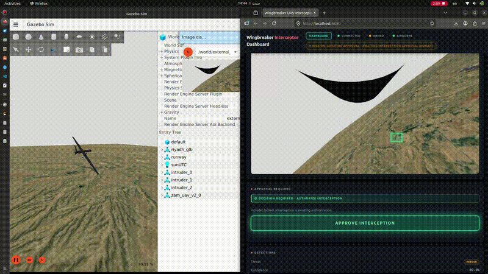
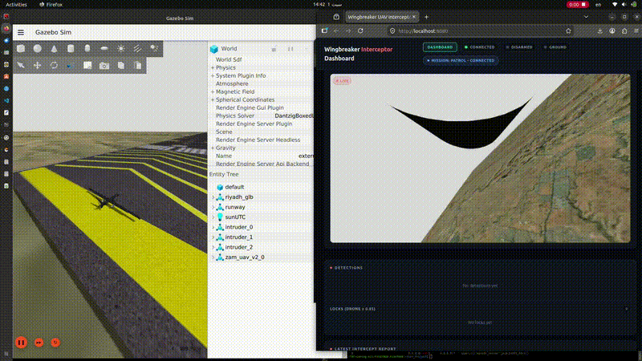
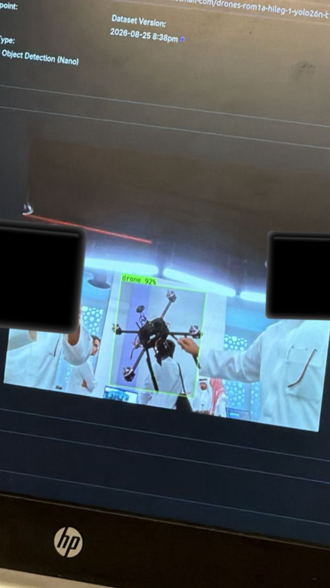
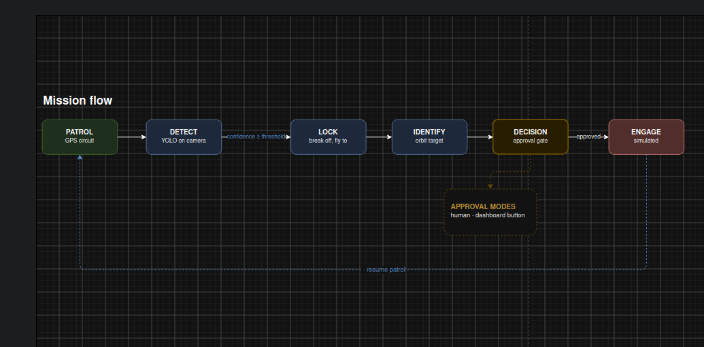
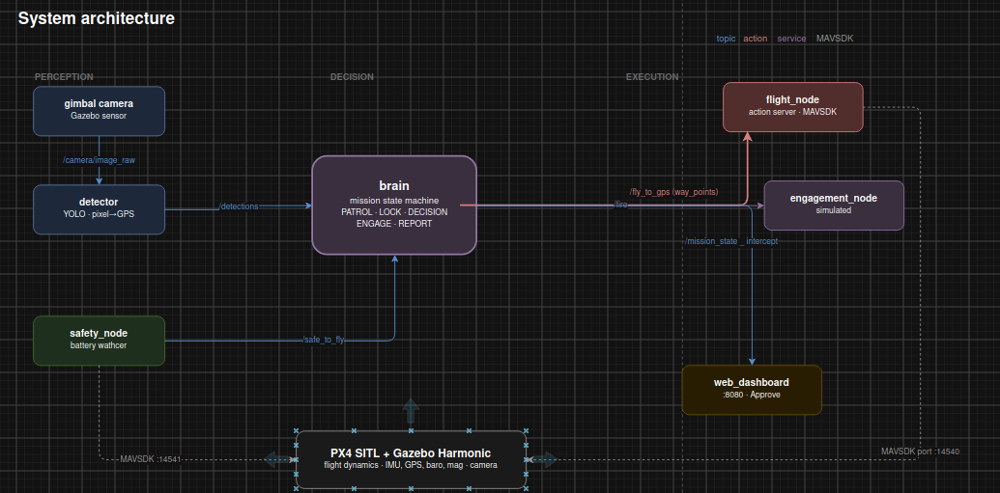

# Wing Breaker

**An autonomous airborne counter-UAS platform that finds the drones ground sensors miss.**



[](https://docs.ros.org/en/humble/)
[](https://px4.io/)
[](https://gazebosim.org/)
[](https://docs.ultralytics.com/)
[](LICENSE)

---

## The problem

### A gap the 2026 Gulf conflict made concrete

When Iran launched its retaliatory campaign against all six GCC states from 28 February 2026, roughly 6,400 missiles and drones were fired at the Gulf states and Jordan before the April ceasefire — over 80% of Iran's attacks on other states, killing at least 28 people across the GCC.[^1]

The pattern that emerged is the reason this project exists. **Drones penetrated defended airspace more successfully than ballistic missiles.** In the opening exchange the UAE intercepted 541 drones, but 35 got through and caused damage on the ground.[^2] Analysts attribute this to a structural mismatch: Shahed-type loitering munitions fly low and slow, approaching beneath radar coverage designed for high-altitude ballistic threats, and Patriot and THAAD batteries optimised for fast, steep trajectories cannot reliably close that detection gap.[^3]

The economics compound it. A Shahed costs $20,000–$50,000; the Patriot interceptor fired to stop it costs around $4 million.[^4] Defending at that exchange rate is not sustainable against sustained salvos, and the Gulf's response has been to move down the cost curve — counter-UAS is now the fastest-growing defence procurement category in the GCC, with Saudi Arabia, the UAE and Qatar signing a ten-year interceptor-drone agreement with Ukraine in April 2026.[^4]

Cheaper effectors, however, expose the layer underneath. Directed-energy weapons and interceptor drones solve the cost of *killing* a target; neither solves *finding* it. Precision aiming demands a quality of perception that most deployed systems do not have.[^5] **Detection, not interception, is the binding constraint.**

### Why the existing sensor layer misses small drones

**Radar** filters them out. A small UAS presents a radar cross-section comparable to a large bird, flies below the horizon of most installations, and moves slowly enough that Doppler processing discards it as ground clutter. Tightening those filters to catch drones floods the operator with false returns from birds and vehicles.

**Lidar** cannot cover the volume. Range is short, the sensor needs unobstructed line of sight, and performance degrades in dust, haze, and rain. Protecting a facility perimeter would require an impractical number of units.

**RF detection** assumes a radio link. It works well against a pilot flying by controller, and not at all against a drone flying a pre-programmed GPS route with its transmitter off — which is the case that matters most.

**Acoustic sensors** have a range of a few hundred metres at best and fail in any environment with traffic, machinery, or wind.

The common thread: every one of these is **fixed, ground-based, and waiting**. A drone that stays low, flies autonomously, and approaches from an unmonitored bearing crosses the perimeter before anything registers it.

---

## The solution

Wing Breaker inverts the geometry. Instead of adding another sensor to the ground, it puts an **electro-optical sensor on a fixed-wing aircraft that patrols the airspace continuously**.

That single change addresses the failure modes above:

| Ground sensor limitation | Airborne EO response |
|---|---|
| Fixed position, fixed coverage | Sensor moves; a patrol circuit sweeps the whole perimeter |
| Low-altitude blind spots, ground clutter | Looks **down and outward** against open sky — clean background |
| Requires an RF emission | Passive vision; RF-silent drones are equally visible |
| Range-limited, needs many units | One aircraft covers what a network of static sensors would |
| Detects a return, cannot identify it | Classifies visually — a drone is distinguished from a bird |

Detection is only half of it. Because the sensor is on an aircraft, the platform **closes the range on its own detection**: it breaks off patrol, flies to the target, holds an orbit for positive identification, and requests authorization to act. Ground sensors detect and then wait for someone else to respond; this platform detects and responds in one loop — the drone-on-drone posture the region is now procuring toward, built on a low-cost printable airframe rather than a multimillion-dollar interceptor.

**Scope.** This is a university project. The autonomy and perception stack is validated in software-in-the-loop simulation and runs as deployment code; the flight-control path has additionally been exercised in hardware-in-the-loop on real autopilot hardware. Engagement is a logged service call — no effector of any kind is modelled or implemented. The contribution is the detection-and-intercept autonomy, not a weapon.

---

## Demo

### Autonomous detection and intercept


YOLO locks onto an intruder from the nose camera. The brain cancels the active patrol goal, switches to intercept, and flies to the estimated target position — no operator input at any point.

### Autonomous takeoff and patrol



The aircraft arms, takes off from the runway, and enters the patrol circuit driven entirely by the ROS 2 stack.

### Real-world detection test



The same YOLO weights running against a live webcam feed, detecting a physical drone. This validates that the detection model generalises beyond the simulated imagery it was integrated against.

Scope of this test: it demonstrates detection of a real airframe from a static ground-level camera. Airborne detection at operational range — where the target occupies far fewer pixels against a sky background, with platform motion — remains untested.

---

## Mission flow



1. **Patrol** — the aircraft flies a closed GPS waypoint circuit at altitude.
2. **Detect** — YOLO runs on the gimbal camera feed; the strongest detection is converted from pixel coordinates to an estimated intruder GPS position.
3. **Lock** — the brain cancels the active patrol goal, switches state, and flies to the estimated position.
4. **Identify** — it orbits the target so the wide-FOV camera holds it in frame.
5. **Decide** — approval is requested via one of three configurable modes: a human clicking Approve on the dashboard, an LLM policy node, or automatic.
6. **Engage and report** — the engagement service is called and an `InterceptReport` is published to the dashboard.
7. **Resume** — after a cooldown the aircraft rejoins the patrol circuit.

### Pixel to GPS

The detector converts a bounding box into a world position without any depth sensor. The horizontal pixel offset of the box centre maps through the camera's horizontal FOV to a bearing offset from the aircraft's own heading; the target is then projected along that bearing at an assumed range from the aircraft's GPS position. It is deliberately simple, and it is enough to fly an intercept — refinement with stereo depth or telemetry fusion is the obvious next step.

---

## System architecture



The design uses each ROS 2 communication primitive where it belongs:

- **Topics** for continuous streams — camera frames, detections, battery, mission state.
- **An action** (`fly_to_gps`) for flight, because flying to a coordinate is long-running, reports progress, and **must be cancellable** the instant a higher-priority target appears. This is what makes breaking off patrol mid-leg possible.
- **Services** (`fire`, `request_interception`) for discrete request/response decisions.

Two architectural choices worth noting:

**The brain never touches MAVSDK.** All flight is abstracted behind the action interface, so the decision logic and the autopilot backend are independent. Swapping MAVSDK for PX4 offboard control would not change a line of the state machine.

**The safety node connects to the autopilot independently** on its own port. A fault in the flight node cannot suppress the battery safety signal.

### Nodes

| Node | Role |
|---|---|
| `brain` | Mission state machine (PATROL / LOCK / DECISION / ENGAGE / REPORT). Runs on a MultiThreadedExecutor with a reentrant callback group so detections are processed while a flight goal is still active. |
| `flight_node` | `fly_to_gps` action server. Bridges ROS 2 to MAVSDK by running an asyncio loop in a background thread. Arms, takes off, navigates, and streams range-to-target as feedback. |
| `detector` | YOLO inference on the camera feed with pixel-to-GPS estimation. Falls back to a synthetic detection mode for testing the pipeline without imagery. |
| `safety_node` | Independent battery watchdog publishing `safe_to_fly` at 1 Hz. |
| `engagement_node` | Simulated engagement services. |
| `intercept_llm` | Optional LLM-based approval policy node. |
| `web_dashboard` | Local web UI on `:8080` — live camera, mission state, telemetry, detections, intercept reports, and the human Approve button. |
| `wait_for_topic` | Startup gate; holds the application nodes until the camera feed is live. |

---

## The airframe

A Reaper-style pusher-prop fixed-wing with a V-tail, designed in Blender and used for three purposes at once: the simulation model, the detection platform, and a physical prototype.

| | Design model | Prototype print |
|---|---|---|
| Wingspan | 2500 mm | 1500 mm |
| Length | 1093 mm | 656 mm |
| Height | 344 mm | 206 mm |
| Fuselage | 1033 mm | 620 mm |

### Design work

The base geometry was heavily reworked to serve as a functional aircraft rather than a static asset:

- **Fuselage reprofiled** — the nose was sculpted through several iterations to a drooped profile, applied as a quadratic falloff over the forward third so the curve stays continuous rather than creasing at the boundary.
- **Sensor bay** — the original decorative sensor turret was removed and replaced with a **flush 16 mm circular lens seat** in the nose. Behind it sits an internal channel sized for a 19 × 19 mm FPV camera, which is inserted from *inside* the fuselage and seats against the front wall, leaving only the lens visible in the skin. No external housing, no aerodynamic bump.
- **Wing separated into left and right halves**, each a closed solid with a filled root face, so the two sides print and mount independently.
- **Control surfaces split out** as individual parts — two ailerons and four flap sections, separated from the main wing so each can be hinged and driven by its own servo rather than moulded in as fixed geometry.
- **Underwing stores rationalised** — the large inboard stores were removed and four slim missiles retained, as a payload-configuration placeholder.
- **Livery** — matte black scheme with tail flags and a fuselage logo, applied as materials and decals for renders and the simulation model.

### Assembly system

The prototype is sectioned for a 350 × 320 mm print bed and designed around off-the-shelf hardware rather than glue alone:

| Joint | Method |
|---|---|
| Wing ↔ wing ↔ fuselage | 8 mm spar hole running through both wings and the fuselage, carrying bending load |
| Wing anti-rotation | 4 mm aft pin plus two 4 mm root locating pins per side |
| V-tail ↔ fuselage | Two 4 mm pins per surface |
| Gear leg ↔ airframe | 4 mm mounting pin, plus a 25 mm plate seated in a milled recess with M3 screws |
| Wheel ↔ gear leg | 14 mm axle boss with a 4 mm through-hole for standard RC wheels |
| Camera ↔ nose | Interior channel, press-fit against the lens seat |

Sectioning: fuselage in 3, each wing in 3, V-tail in 2, gear legs and control surfaces whole.

**Consumables:** one 8 mm rod (≈1.6 m), 4 mm rod stock, 6 × M3 screws and nuts, 3 × RC wheels with 4 mm axles.

### Simulation model

Flight dynamics are inherited from PX4's `advanced_plane` reference airframe — proven aerodynamic coefficients, control-surface mixing, and motor model — with the custom geometry applied as visual meshes and a gimbal camera added for detection. Building on a validated physics baseline rather than hand-tuned coefficients removed an entire class of frame and thrust-axis faults (see Engineering notes).

---

## Hardware

> Component list for the prototype build. **Verify part numbers against your actual bill of materials before publishing.**

### Flight hardware

| Item | Qty | Purpose |
|---|---|---|
| Pixhawk 6C flight controller | 1 | Runs PX4 firmware |
| GPS / compass module | 1 | Position and heading |
| Brushless motor + ESC | 1 | Pusher propulsion |
| Servo — aileron | 2 | Roll control |
| Servo — flap | 2–4 | High-lift devices |
| Servo — ruddervator | 2 | V-tail pitch and yaw |
| FPV camera, 19 × 19 mm | 1 | Detection sensor, nose-mounted |
| LiPo battery + power module | 1 | Propulsion and avionics power |
| RC receiver | 1 | Manual override / safety pilot |
| Telemetry radio | 1 | Ground link |
| Companion computer | 1 | Runs the ROS 2 stack and YOLO onboard |

### Hardware-in-the-loop

Before committing to the fixed-wing prototype, the HITL pipeline was brought up on a **quadcopter testbed** — four motors and ESCs on a Pixhawk running PX4 — because a multirotor is a faster and more forgiving platform on which to prove the toolchain.

HITL differs from SITL in where the firmware executes. In SITL, PX4 runs as a process on the development machine. In **HITL the firmware runs on the actual flight controller**, which receives simulated sensor data over USB and returns real actuator commands — so the autopilot code, timing, and I/O paths under test are the ones that will fly.

Bringing this up validated:

- Firmware, mixer, and actuator outputs on real hardware
- Servo and ESC response driven by the simulated flight loop
- Sensor calibration and the ground-station link
- The transition path from a simulated model to a physical airframe

Practical note: HITL requires **Gazebo Classic**, which conflicts with the Gazebo Harmonic installation used for the SITL work. The two cannot be installed side by side without breaking each other, so the environments are switched deliberately rather than run concurrently.

---

## Project structure

```
Wing_Breaker_UAV/
│
├── wingbreaker_uav/                  ROS 2 application package
│   ├── wingbreaker_uav/
│   │   ├── brain.py                  mission state machine
│   │   ├── flight_node.py            fly_to_gps action server, MAVSDK bridge
│   │   ├── detector.py               YOLO detection + pixel→GPS estimation
│   │   ├── safety_node.py            battery watchdog
│   │   ├── engagement_node.py        simulated engagement services
│   │   ├── intercept_llm.py          LLM approval policy
│   │   ├── web_dashboard.py          browser dashboard on :8080
│   │   ├── drone_gateway.py          shared MAVSDK connection helper
│   │   ├── pi_bridge.py              companion-computer bridge
│   │   └── wait_for_topic.py         startup gate
│   ├── launch/
│   │   ├── wingbreaker.launch.py     full stack: PX4 + Gazebo + bridge + nodes
│   │   ├── pi_mode.launch.py         companion-computer deployment
│   │   └── qgc_novnc.launch.py       QGroundControl in the browser
│   ├── config/
│   │   ├── uav.yaml                  all node parameters
│   │   └── pi_mode.yaml
│   └── scripts/
│       ├── intruder_sim.py           spawns and moves intruder drones
│       └── novnc_bridge.py
│
├── wingbreaker_interfaces/           custom ROS 2 interfaces
│   ├── action/FlyToGPS.action
│   ├── msg/IntruderDetection.msg
│   ├── msg/VehicleStatus.msg
│   ├── msg/MissionState.msg
│   ├── msg/InterceptReport.msg
│   └── srv/RequestInterception.srv
│
├── sim/                              simulation assets
│   ├── models/
│   │   ├── zam_uav/                  airframe meshes (OBJ + textures)
│   │   ├── zam_uav_v2/               PX4 model: sensors, gimbal camera, aero
│   │   ├── intruder_drone/           kinematic target
│   │   └── intruder_x500*/           quadcopter target models
│   ├── worlds/
│   │   ├── runway_world.sdf          Riyadh terrain with runway
│   │   └── external_world.sdf
│   ├── meshes/                       terrain and runway GLB assets
│   └── airframes/
│       └── 4031_gz_zam_uav_v2        PX4 airframe definition
│
├── hardware/                         printable STLs and assembly notes
├── docs/                             diagrams, demo media, briefing, poster
├── yolo26n_DroneDetection.pt         trained drone-detection weights
└── README.md
```

---

## Tech stack

| Layer | Technology |
|---|---|
| Middleware | ROS 2 Humble |
| Autopilot | PX4 — SITL and HITL |
| Simulator | Gazebo Harmonic (SITL), Gazebo Classic (HITL) |
| Vehicle API | MAVSDK-Python |
| Detection | Ultralytics YOLO, OpenCV |
| Airframe CAD | Blender |
| Manufacturing | FDM 3D printing, sectioned and hardware-assembled |

---

## Quick start

### Prerequisites

```bash
# simulation stack
sudo apt install gz-harmonic ros-humble-ros-gzharmonic ros-humble-cv-bridge

# python
pip install mavsdk ultralytics "numpy<2" "opencv-python<4.10"
```

> **NumPy pinning matters.** ROS 2 Humble's `cv_bridge` is compiled against NumPy 1.x. Installing NumPy 2 breaks image conversion with an `_ARRAY_API not found` error, which silently disables the camera feed and detection.

### Install the simulation assets into PX4

```bash
cp -r sim/models/*      ~/PX4-Autopilot/Tools/simulation/gz/models/
cp    sim/worlds/*.sdf  ~/PX4-Autopilot/Tools/simulation/gz/worlds/
cp    sim/airframes/4031_gz_zam_uav_v2 \
      ~/PX4-Autopilot/ROMFS/px4fmu_common/init.d-posix/airframes/

# register the airframe with the build system
cd ~/PX4-Autopilot/ROMFS/px4fmu_common/init.d-posix/airframes
grep -q zam_uav_v2 CMakeLists.txt || \
  sed -i '/4008_gz_advanced_plane/a\\t4031_gz_zam_uav_v2' CMakeLists.txt

cd ~/PX4-Autopilot && make px4_sitl_default
```

### Build and run

```bash
cd ~/UAV_Project
colcon build
source install/setup.bash

ros2 launch wingbreaker_uav wingbreaker.launch.py
```

Open **http://localhost:8080** for the mission dashboard.

**Options**

```bash
# parked targets instead of moving ones
ros2 launch wingbreaker_uav wingbreaker.launch.py intruder_mode:=static

# LLM decides engagement instead of a human
ros2 launch wingbreaker_uav wingbreaker.launch.py approval_mode:=llm run_llm:=true

# QGroundControl in the browser
ros2 launch wingbreaker_uav qgc_novnc.launch.py
```

---

## Configuration

All tuning lives in `wingbreaker_uav/config/uav.yaml` — no source edits required.

| Parameter | Purpose |
|---|---|
| `detector.model_path` | YOLO weights file |
| `detector.confidence_threshold` | Minimum score to report a detection |
| `detector.assume_range_m` | Assumed target range for the pixel→GPS estimate |
| `detector.hfov_deg` | Camera horizontal field of view |
| `brain.waypoints` | Patrol circuit as a flat lat/lon list |
| `brain.patrol_alt` | Patrol altitude |
| `brain.orbit_radius_m` | Identification orbit radius |
| `brain.approval_mode` | `human` \| `llm` \| `auto` |
| `flight_node.arrival_radius_m` | Waypoint arrival tolerance |
| `safety_node.low_threshold` | Battery percentage floor |

---

## Engineering notes

Problems solved during development that are not obvious from the code:

**Sensors reporting STALE in PX4.** Sensor definitions were structurally present but PX4 saw no data. The cause was empty sensor elements — Gazebo Harmonic will not instantiate a sensor without its inner noise-model block, so the sensors existed but never published. Copying the complete blocks from a known-good reference airframe resolved it.

**Thrust in the wrong direction.** The motor plugin applies thrust along the joint axis, which did not match the propeller mesh's orientation. The aircraft accelerated backwards, then produced no useful thrust at all, before the mesh and joint frames were aligned.

**Aircraft that would not rotate.** With thrust corrected the aircraft reached 70 m/s on the ground and never lifted off, because the airspeed estimate disagreed with true motion by exactly 90° — a frame misalignment. Rebuilding the model on PX4's reference physics rather than hand-tuned coefficients eliminated the entire class of problem.

**Arming succeeded, then failsafe disarmed immediately.** RC and datalink loss failsafes fire the moment an autonomous stack arms without a ground station attached. The fix belongs in the airframe file as `param set-default`, not typed into a console, so it survives a fresh parameter file.

**Print quality traced back to mesh preparation.** The source geometry was a game asset with open edges, so parts were made watertight with a solidify-and-voxel-remesh pass before export. Prints came out soft and lacking surface detail. The cause was the remesh itself: rebuilding the surface on a 2 mm voxel grid rounds off every feature smaller than the grid. Dropping the remesh where the geometry was already closed, and using a fine voxel size only where it was needed, restored the detail. Vertex counts made the trade explicit — 326 for the clean part, 1,192 after the coarse remesh that had destroyed its edges.

**Slicer unit mismatch.** Blender exports STL in scene units; slicers assume millimetres. Parts imported at 1/1000 scale and were reported as unprintable. Baking the scale factor into the export rather than relying on the slicer's rescale prompt made the files portable.

---

## Limitations

- The autonomy stack is validated in software-in-the-loop; HITL exercised the flight-control path on real hardware but not the full mission stack. The printed airframe has not been flight-tested.
- Detection has been validated against a real drone on a static ground camera. Airborne detection at operational range is untested.
- Pixel-to-GPS estimation assumes a fixed target range and level flight. Accuracy degrades with altitude difference and off-axis targets.
- Detection performance inherits the training set's conditions; adverse weather and low light are untested.
- Engagement is a logged service response with no modelled effector.
- The LLM approval node ships with a mock policy; wiring a live provider is left as an integration point.
- The threat context above motivates the work; this platform addresses the *detection* layer of that problem and does not claim to counter salvo attacks.

## Roadmap

- Complete the prototype build and conduct flight testing
- Move the perception stack onboard the companion computer for autonomous operation off-tether
- Stereo or monocular depth to replace the assumed-range estimate
- Multi-target tracking with persistent IDs across frames
- Multi-aircraft coordination over a shared detection topic
- Wind and sensor noise models for robustness testing

---

## Contributors

| | |
|---|---|
| **[Your Name]** | Airframe design and CAD, printable prototype and assembly system, Gazebo/PX4 model integration, flight dynamics, hardware-in-the-loop bring-up, ROS 2 architecture — brain state machine, flight action server, safety watchdog — simulation worlds |
| **Khalid ([@xKhalid1](https://github.com/xKhalid1))** | YOLO detection model and training, camera integration and pixel-to-GPS estimation, web dashboard, LLM approval layer, intruder simulation |

## License

Apache-2.0

---

[^1]: [Lessons Learned by GCC States in the 2026 US-Israel-Iran War](https://mecouncil.org/publication/lessons-learned-by-gcc-states-in-the-2026-us-israel-iran-war/), Middle East Council on Global Affairs, July 2026.
[^2]: [Nightmare scenario for GCC countries, region as Iran unloads drones and missiles](https://breakingdefense.com/2026/03/iran-attacks-uae-saudi-missiles-drones-gcc-air-defense/), Breaking Defense, March 2026.
[^3]: [The Shahed Model: Cost Asymmetry and the Transformation of Air Warfare](https://bisi.org.uk/reports/the-shahed-model-cost-asymmetry-and-the-transformation-of-air-warfare), Bloomsbury Intelligence and Security Institute, April 2026.
[^4]: [Rewriting the Missile Math: Low-Cost Defence in the Gulf](https://orfme.org/expert-speak/rewriting-the-missile-math-low-cost-defence-in-the-gulf/), ORF Middle East, July 2026.
[^5]: [The Interception Gap: Directed Energy Solved Cost of Shooting Down Drones, Exposed a Harder Problem Underneath](https://www.globenewswire.com/news-release/2026/08/25/3350443/0/en/the-interception-gap-directed-energy-solved-cost-of-shooting-down-drones-exposed-a-harder-problem-underneath.html), August 2026.
